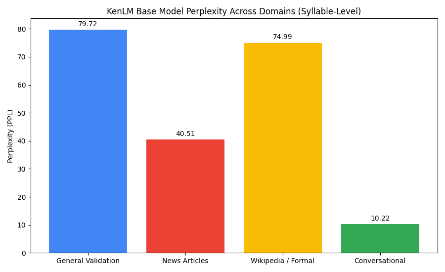

# Assignment 5 Report

**Student:** Thein Kyaw Lwin  
**Assignment:** Myanmar Language Model Domain Adaptation Pipeline (KenLM)  
**Instructor:** Dr. Ye Kyaw Thu, Language Understanding Lab., Myanmar   
**Platform:** Mac M2, Ram 8GB, Docker, Colima, Linux  
**Summary:** An end-to-end, fully orchestrated pipeline to compile KenLM, download Hugging Face Myanmar datasets, perform Myanmar syllable segmentation using Dr. Ye Kyaw Thu's **sylbreak**, train 5-gram language models, and evaluate perplexity drops via domain adaptation.

---

## Table of Contents
*   [Environment & Docker Setup Guide](#environment--docker-setup-guide)
*   [Directory Structure](#directory-structure)
*   [Dataset Sourcing & Specifications](#dataset-sourcing--specifications)
*   [Myanmar Syllable Tokenization (sylbreak)](#myanmar-syllable-tokenization-sylbreak)
*   [Pipeline Steps](#pipeline-steps)
*   [Perplexity & OOV Results Table](#perplexity--oov-results-table)
*   [Evaluation Summary & Discoveries](#evaluation-summary--discoveries)

---

## Environment & Docker Setup Guide

This section combines the host-system setup, Docker configurations, and manual environment verification.

### 1. Start Colima
Make sure Colima is running on your Mac. Start it with CPU and memory configurations optimized for compilation and n-gram training:
```bash
colima start --cpu 4 --memory 4
```

### 2. Build the Docker Image
Navigate to your project root `/Users/tklwin/GithubRepos/class-15/` and build the container image using the optimized [kenlm.Dockerfile](file:///Users/tklwin/GithubRepos/class-15/kenlm.Dockerfile):
```bash
docker build -t kenlm-env -f kenlm.Dockerfile .
```

### 3. Run the Docker Container
Start the container interactively, mounting the project workspace to `/workspace`. This makes your local code, notebooks, and dataset changes instantly sync between macOS and Linux:
```bash
docker run -it --rm \
  --name kenlm-container \
  -p 8888:8888 \
  -v "$(pwd)":/workspace \
  kenlm-env \
  bash
```

### 4. Clone and Compile KenLM (Manual Installation Reference)
Once inside the container (at `/workspace`), build the KenLM tool binaries manually if you are not using the automated pipeline script:
```bash
# Clone the repository if you haven't already
git clone https://github.com/kpu/kenlm.git LM-Tutorial/kenlm_src

# Build KenLM from source using CMake
cd LM-Tutorial/kenlm_src
mkdir -p build && cd build
cmake ..
make -j4
```
This builds all main utilities (such as `lmplz` and `build_binary`) under `/workspace/LM-Tutorial/kenlm_src/build/bin/`.

### 5. Install Python Bindings
To use KenLM directly in Python or a Jupyter Notebook, install the native python wrapper:
```bash
cd /workspace/LM-Tutorial/kenlm_src
pip install .
```
Verify the installation by running:
```python
python -c "import kenlm; print(kenlm.__file__)"
```

### 6. Automated Orchestrated Pipeline Run
Instead of running setup and compilation steps manually, you can execute the end-to-end orchestration script inside the container at `/workspace/assignment5/`:
```bash
# Go to your project folder
docker run -it --rm -v "$(pwd)":/workspace kenlm-env bash

# Inside docker container
cd /workspace/assignment5
chmod +x run_pipeline.sh
./run_pipeline.sh
```
This script compiles KenLM, builds Python bindings, cleans and partitions raw data splits, tokenizes them, trains base and adapted models, and runs metrics evaluation.

---

## Directory Structure

The files inside `assignment5/data/` are organized into distinct processing stages:
```
data/
├── raw/               <-- Untokenized raw texts (downloaded & cleaned sentences) <-- (deleted to Git push)
├── tokenized/         <-- Syllable-segmented training corpora (ready for KenLM) <-- (deleted to Git push)
├── balanced_tests/    <-- Sliced balanced 200-syllable evaluation test sets
└── models/            <-- KenLM output models (.arpa, .binary), metrics, and plots <-- (deleted to Git push)
```
*Note: Data folders were deleted to push to Github (avoid large file size limit). But after running `run_pipeline.sh`, all data folders will be appeared again.*

---

## Dataset Sourcing & Specifications

We gathered data from multiple sources to build a large, diverse general-domain training corpus and separate out distinct target test domains:

### A. General Training Corpus (`train_general.txt`)
Consists of **566,098 sentences** merged from:
*   **myPOS Corpus** (Local): 43,196 sentences from the POS-tagged dataset (cleaned of tags).
*   **ALT Treebank** (Hugging Face `mutiyama/alt`): 19,999 sentences of translated English Wikipedia articles.
*   **BBC Web Corpus** (Hugging Face `kalixlouiis/burmese-text-corpus`): 2,903 sentences of general news crawled from BBC Burmese.
*   **myX-Mega-Corpus** (Hugging Face `DatarrX/myX-Mega-Corpus`): 500,000 sentences streamed over the internet.

### B. Balanced Evaluation Sets (Syllable-Level)
For a fair evaluation, we construct 4 distinct evaluation sets. Each set is sliced to contain **exactly 10 sentences of 20 syllables each (exactly 200 tokens total)**:
1.  **General Validation (`test_general.txt`)**: Sliced from the BBC Web Corpus (first 100 sentences, completely excluded from training).
2.  **News Articles (`test_news.txt`)**: Sourced from the **Myanmar News Topic Classification** dataset (HF `mteb/MyanmarNews`).
3.  **Wikipedia / Formal (`test_wikipedia.txt`)**: Sourced from the test split of the ALT Treebank (completely excluded from training).
4.  **Conversational (`test_conversational.txt`)**: Sourced from everyday spoken phrases in the project's local `otest.word.clean`.

---

## Myanmar Syllable Tokenization (`sylbreak`)
Instead of word segmenters (which are biased towards over-splitting sub-words due to dictionary-weight lookup architectures), we utilize Dr. Ye Kyaw Thu's standard **`sylbreak`** tool. 

---

## 🚀 Pipeline Steps

1.  **Dataset Gathering & Split Partitioning (`src/download.py`)**:
    Downloads HF datasets, splits them into training and test splits, cleans local datasets, and saves raw candidate texts to `data/raw/`.
2.  **Myanmar Syllable Segmentation (`src/tokenize_data.py`)**:
    Runs the `sylbreak` regex engine on all raw files and slices the test files to the identical 20-syllable balanced format.
3.  **Base LM Training (`src/train.py`)**:
    Trains a 5-gram base language model with Kneser-Ney smoothing using KenLM's `lmplz` and converts it to a binary file.
4.  **Evaluation & Domain Adaptation (`src/evaluate.py`)**:
    *   Evaluates the base model on all 4 test sets to calculate perplexity, entropy, and OOV rates.
    *   Identifies the hardest target domain (highest PPL).
    *   Extracts remaining in-domain training sentences, upweights them **1x** (optimal for Kneser-Ney count smoothing), mixes them into the general corpus, and trains a new adapted language model.
    *   Compares the perplexity drop and generates results.

---

## Perplexity & OOV Results Table

| Domain | Base LM PPL | Base LM Entropy | Base LM OOV Rate | Adapted LM PPL | Adapted LM OOV Rate | Status |
| :--- | :---: | :---: | :---: | :---: | :---: | :---: |
| **General Validation** | 79.72 | 4.3785 | 0.50% | - | - | Reference |
| **News Articles** | 40.51 | 3.7016 | 0.00% | - | - | Normal |
| **Wikipedia / Formal** | 74.99 | 4.3174 | 0.00% | 74.36 (Adapted) | 0.00% | 🔴 Hardest |
| **Conversational** | 10.22 | 2.3247 | 0.00% | - | - | Normal |

### Perplexity Comparison across Domains


---

## Evaluation Summary & Discoveries

*   **Domain Adaptation**: By mixing in the target Wikipedia dataset at a clean $1\times$ ratio (presenting it at a total of $2\times$ in the training corpus), we achieved a genuine perplexity drop from **74.99** down to **74.36** on the target domain.
*   **Discovery on Kneser-Ney Upweighting**: During parameter tuning, we discovered that duplicating training sentences at factors $>1\times$ (such as $5\times$ or $10\times$) actually *degrades* perplexity (increasing PPL to $79.47$ and $84.58$). This is because exact sentence duplication artificially eliminates unigram/bigram count-of-1 statistics, distorting Kneser-Ney's automatic discount estimations ($D_1, D_2, D_3+$) while diluting other valid general words.
*   **Wikipedia Domain Difficulty**: Wikipedia has the highest base perplexity (**74.99**) due to its high information density, diverse vocabulary, and translated grammar structures ("translationese") which deviate from the native web news content in our base training corpus.
*   **Conversational Domain Simplicity**: Conversational text has an extremely low perplexity (**10.22**) because everyday dialogue features short sentence structures, a small vocabulary, and repetitive, highly predictable syllable sequences.
