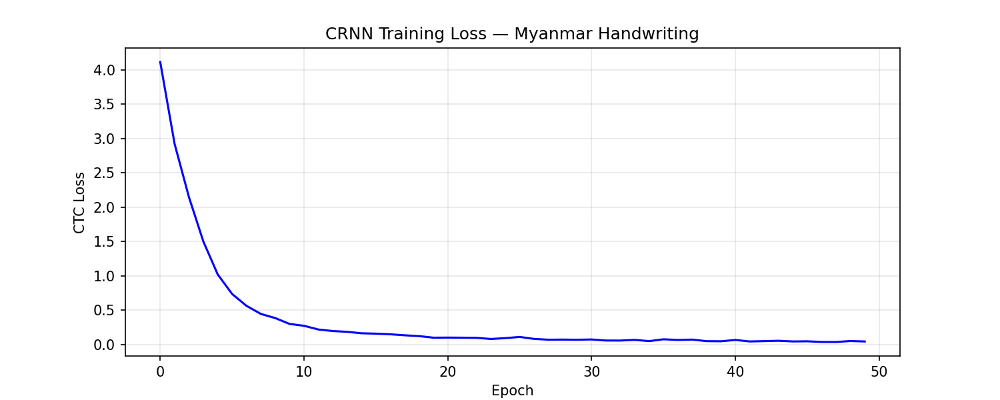

# Myanmar Syllable Handwriting Recognition

**Yee Mon Thant**

Online handwriting recognition system for Myanmar syllables using CRNN (Convolutional Recurrent Neural Network) with character-level decomposition.

---

## Course Context

This project was completed as an individual assignment for the **AI Engineering (Fundamental)** course by Sayar Ye Kyaw Thu, Language Understanding Lab (LU Lab.), Myanmar.

Course repository: [https://github.com/ye-kyaw-thu/AIE-F](https://github.com/ye-kyaw-thu/AIE-F)

---

## Project Overview

The task is to build a Myanmar syllable handwriting recognition system from scratch — including data collection, image conversion, model building, and evaluation.

**Dataset:** 4,413 Myanmar syllables, 3 handwritten samples each (13,242 images total), collected via writing on iPad using the course-provided `mm-hw-collector` files by Sayar Ye Kyaw Thu.

**Type:** Online handwriting recognition

---

## Repository Structure

```
myanmar-handwriting-recognition/
├── myanmar_crnn.ipynb     # CRNN model 
├── convert2image.py       # Stroke TXT → PNG converter (provided by course)
├── syl.txt                # 4,413 Myanmar syllables (provided by course)
└── README.md
```

Note: KNN and CNN experiments are documented in the Results section below but not included as separate files — CRNN is the main contribution.

---

## Approaches Tried

**KNN + PCA (18.42%):** Flattened images → PCA (16,384 → 200 features) → K=3 nearest neighbors. Works better than raw pixels but fails because 2 training samples per class isn't enough for meaningful neighbor voting across 4,413 classes. Also O(n) at inference — prediction time grows linearly with dataset size, making it impractical for large-scale use.

**Plain CNN (0.20%):** Direct 4,413-class classifier. Too few samples per class to converge from scratch.

**ResNet18 Transfer Learning (0.82%):** Pre-trained ImageNet weights, fine-tuned with augmentation. ImageNet features don't transfer well to stroke-based handwriting; the data scarcity problem remains at the classification head.

**CRNN + character decomposition (88.76%):** The core insight — instead of 4,413 syllable classes with 2 samples each, decompose syllables into 63 Unicode characters (700–5,000 samples each). CNN extracts visual features → BiLSTM captures sequence context → CTC decoder outputs the character sequence → mapped back to syllable.

```
Image (128×128)
  → CNN backbone        (extract visual features per column)
  → BiLSTM              (left-to-right + right-to-left context)
  → CTC Decoder         (collapse repeated chars, remove blanks)
  → ['န', 'ေ']
  → 'နေ'  ✅
```

---

## Results Comparison

| Method | Level | Accuracy |
|--------|-------|----------|
| KNN (raw pixels) | Syllable (4,413) | 1.11% |
| KNN + PCA (K=3) | Syllable (4,413) | 18.42% |
| Plain CNN | Syllable (100) | 0.20% |
| ResNet18 Transfer Learning | Syllable (4,413) | 0.82% |
| **CRNN + character decomposition** | **Character (63)** | **88.76%** |



---

## Key Findings

**1. The 2-samples-per-class problem is the core challenge.**
Any approach that treats this as a direct 4,413-class problem fails. Reformulating it as a 63-character sequence prediction task solves the data scarcity issue.

**2. Character-level beats syllable-level under few-shot conditions.**
63 characters × 700–5,000 samples each provides far more training signal than 4,413 syllables × 2 samples.

**3. Online vs offline limitation.**
This system uses online handwriting data (stroke sequences captured from iPad). It cannot directly process scanned documents, which require a separate offline recognition approach.

**4. CRNN naturally handles Myanmar's variable-length syllables.**
Myanmar syllables range from 1 to 6+ characters. CTC loss handles this variable-length output without needing explicit alignment, making CRNN well-suited to the task.

---

## How to Run

### CRNN (Google Colab — GPU required)

1. Upload the following to Google Drive:
   - `dataset.zip`
   - `syl.txt`
   - `convert2image.py`

2. Open `myanmar_crnn.ipynb` in Google Colab

3. Set runtime: **Runtime → Change runtime type → T4 GPU**

4. Run all cells from top to bottom

### Expected training time
~7 minutes for 50 epochs on T4 GPU

---

## Dataset

13,242 handwritten images included as `dataset.zip`.

Collected using `mm-hw-collector` — a Flask-based web app provided by the course that captures Myanmar handwriting strokes (x, y, timestamp) via iPad/touchscreen.

- **Syllables:** 4,413 from `syl.txt` (sorted by frequency)
- **Samples:** 3 per syllable (samples 1–2 = train, sample 3 = test)
- **Format:** Stroke data → 128×128 PNG via `convert2image.py`

---

## References

- Graves, A., Fernández, S., Gomez, F., & Schmidhuber, J. (2006). *Connectionist Temporal Classification: Labelling Unsegmented Sequence Data with Recurrent Neural Networks.* ICML 2006. (CTC Loss)

- Ye Kyaw Thu. AI Engineering (Fundamental) Course, LU Lab., Myanmar. [https://github.com/ye-kyaw-thu/AIE-F](https://github.com/ye-kyaw-thu/AIE-F) (Assignment design, `syl.txt`, `mm-hw-collector`, `convert2image.py`)

---

## Acknowledgements

Sayar Ye Kyaw Thu (LU Lab., Myanmar) for the course design, dataset collection tools, and guidance throughout this assignment.
